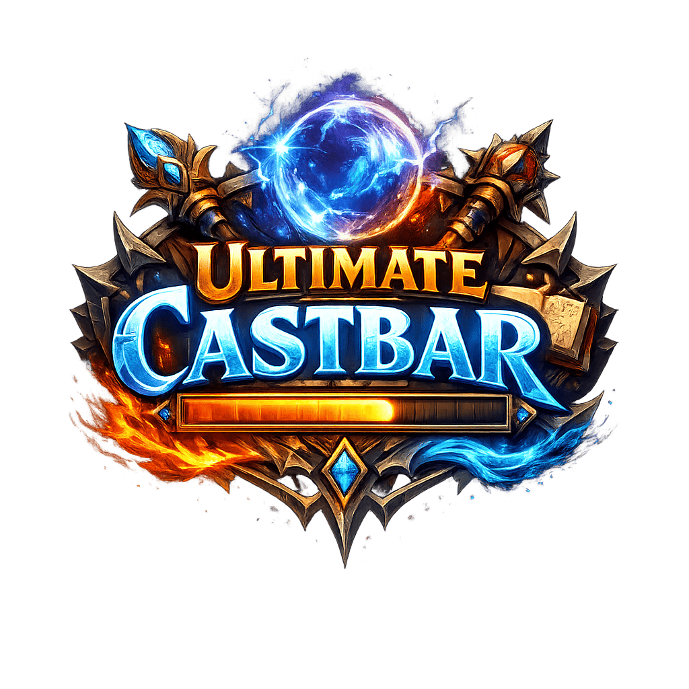

<!-- Buttons -->

[![Wago](https://img.shields.io/badge/Wago-Download-c1272d?style=for-the-badge&logo=data:image/svg%2Bxml;base64,PHN2ZyB4bWxucz0iaHR0cDovL3d3dy53My5vcmcvMjAwMC9zdmciIHZpZXdCb3g9IjAgMCA1NDEuNyAzMTEuNiI%2BPGRlZnM%2BPHN0eWxlPi5jbHMtMXtmaWxsOiNmZmY7fS5jbHMtMntmaWxsOiNjMTI3MmQ7fTwvc3R5bGU%2BPC9kZWZzPjxnIGlkPSJMYXllcl8yIiBkYXRhLW5hbWU9IkxheWVyIDIiPjxnIGlkPSJMYXllcl8xLTIiIGRhdGEtbmFtZT0iTGF5ZXIgMSI%2BPHBhdGggY2xhc3M9ImNscy0xIiBkPSJNMjMwLjgsMTQwLjZoNzkuOGE3Ny4xMSw3Ny4xMSwwLDAsMSw2MC44LTYwLjdWMEExNTYuMTMsMTU2LjEzLDAsMCwwLDIzMC44LDE0MC42WiIvPjxwYXRoIGNsYXNzPSJjbHMtMiIgZD0iTTQ2MS45LDE0MC42aDc5LjhBMTU2LjEzLDE1Ni4xMywwLDAsMCw0MDEuMSwwVjc5LjhBNzcuMSw3Ny4xLDAsMCwxLDQ2MS45LDE0MC42WiIvPjxwYXRoIGNsYXNzPSJjbHMtMSIgZD0iTTMxMC43LDE3MC45YzAtLjIuMS0uNC4xLS42aC04MGExLjI3LDEuMjcsMCwwLDAsLjEuNiw3Ny4wNiw3Ny4wNiwwLDAsMS0xNTEuMS0uNkgwYTE1Ni4yNCwxNTYuMjQsMCwwLDAsMjcxLDkwLjMsMTU1LjM4LDE1NS4zOCwwLDAsMCwxMDAuNiw1MC4zVjIzMUE3Ni45Myw3Ni45MywwLDAsMSwzMTAuNywxNzAuOVoiLz48cGF0aCBjbGFzcz0iY2xzLTEiIGQ9Ik00MDEuMSwyMzEuMVYzMTFBMTU2LjEzLDE1Ni4xMywwLDAsMCw1NDEuNywxNzAuNEg0NjEuOUE3Ny4xMSw3Ny4xMSwwLDAsMSw0MDEuMSwyMzEuMVoiLz48L2c%2BPC9nPjwvc3ZnPg%3D%3D)](https://addons.wago.io/addons/ultimate-castbars)

# Ultimate Castbars

Ultimate Castbar aims to be **the last castbar World of Warcraft addon** you’ll ever need. It is a highly configurabl castbar addon for World of Warcraft (Retail), focused on deep layout control, rich text/tagging, and advanced interruptibility/kick-aware visuals.

### Sources of inspiration and credits

Thanks to Xepheris for [DisintegrateTicks](https://www.curseforge.com/wow/addons/disintegrateticks) on which was based dynamic disintegrate ticks, donate [here](https://www.patreon.com/cw/warcraftlogs) if you liked that feature.

Thanks to obk_wow for [Universal Frame Anchor](https://www.curseforge.com/wow/addons/frame-anchor-ui-builder) on which was based the frame picker, send some love his way if you liked that feature.

Thanks to Danders and his team for [DandersFrames](https://www.curseforge.com/wow/addons/danders-frames) on which was based the colour picker and dropdown UI menu options, donate [here](https://www.paypal.com/paypalme/dandersframesaddon) if you liked those features.

---

## Table of Contents

- [Features](#features)
- [Installation](#installation)
- [Quick Start](#quick-start)
- [Configuration Overview](#configuration-overview)
  - [Per-Unit Bars](#per-unit-bars)
  - [Layout, Anchoring, and Size Sync](#layout-anchoring-and-size-sync)
  - [Text Tags and Tokens](#text-tags-and-tokens)
  - [Style and Visuals](#style-and-visuals)
  - [Interruptibility and Kick Awareness](#interruptibility-and-kick-awareness)
  - [Other Features](#other-features)
  - [Class Settings (Ticks + Filters)](#class-settings-ticks--filters)
  - [Evoker Empower + Disintegrate Support](#evoker-empower--disintegrate-support)
  - [Preview Tools](#preview-tools)
  - [Blizzard Castbar Integration](#blizzard-castbar-integration)
- [Slash Commands](#slash-commands)
- [Profiles, Import/Export, and Copy Tools](#profiles-importexport-and-copy-tools)
- [Debug Mode](#debug-mode)
- [Dependencies](#dependencies)
- [Support](#support)
- [Contributing](#contributing)

---

## Features

### Highlights

- **Per-unit castbars** for `player`, `target`, and `focus` with independent enable/disable and full settings trees.
- Supports **normal casts, channels, and empowered casts**.
- Powerful **multi-tag text system** with custom formula parsing and performance-aware updates.
- Extensive **style controls** (textures, borders, gradients, class/ombre/custom color modes).
- Advanced **uninterruptible + kick-aware visuals** (overlays, “until kick” fills, tick markers, dynamic alpha).
- **Class-specific channel tick tooling** + **player spell blacklist/whitelist**.
- Deep **Evoker** support: empower stage visuals + dynamic **Disintegrate** tick logic (Devastation).
- Robust **preview simulator** that reuses the real cast pipeline.
- Safe-ish **Blizzard castbar coexistence** (hide/show, size/position/scale, restore baseline).
- AceDB **profiles** with **import/export**, schema filtering/normalization, and **copy-between-units** tools.

---

## Installation

### Automatic install

1. Use either [Curse](https://www.curseforge.com/wow/search?page=1&pageSize=20&sortBy=relevancy&class=addons) or [Wago](https://wago.io/) and their corresponding OS apps 

    - Search for “Ultimate Castbars” and click “Install” (Curse) or “Add to collection” (Wago).
    - Follow the prompts to select your WoW installation and desired options.
    - The app will handle downloading, installing, and updating the addon for you with only a few clicks.

### Manual install

1. Download the repository as a ZIP (or a release archive if you publish releases).
2. Extract the **UltimateCastbars sub-folder** into your WoW AddOns folder (the sub-folder should have a file called **UltimateCastbars.toc** inside it):

   - **Windows:** `World of Warcraft\_retail_\Interface\AddOns\`
   - **macOS:** `World of Warcraft/_retail_/Interface/AddOns/`

3. Launch the game and enable the addon in the character select “AddOns” menu.

---

## Quick Start

1. Log in and open options with: `/ucb`
2. Enable the bar(s) you want (Player/Target/Focus).
3. Use the **Preview** buttons to spawn test casts (normal/channel/empowered).
4. Adjust anchoring and offsets until the bar sits where you want it.
5. Customize text tags, textures, borders, and interruptibility visuals.

---

## Configuration Overview

### Per-Unit Bars

Each tracked unit (`player`, `target`, `focus`) has its own settings tree:

- Enable/disable per unit
- Preview controls per unit
- Copy settings from another unit bar
- Tabs for general layout, text, style, uninterruptible/kick visuals, visibility, class settings, and Blizzard default castbar handling

---

### Layout, Anchoring, and Size Sync

The **General** tab provides deep positioning controls:

- Anchor to any frame by name (default `UIParent` or custom frame)
- Separate `anchorFrom` / `anchorTo` point pairing
- X/Y offsets
- Frame picker helper (hover-to-identify frames)
- Late-loading frame resolution (retry + delay/interval settings)
- Optional size sync to another frame:
  - Sync width and/or height, with offsets
  - Min width/height
  - Options to include border thickness in effective sizing

**Icon layout:**
- Show/hide icon
- Anchor icon around the bar (sides/corners/top/bottom)
- Offsets
- Sync icon size to bar height or set explicit width/height

 |

---

### Text Tags and Tokens

Ultimate Castbars includes a custom text engine:

- Multiple text entries per bar (`textList`)
- Per-tag enable/disable + display name
- Per-tag type: **Cast**, **Interrupted**, **Cancelled**
- Per-tag show rules:
  - By cast type (normal/channel/empowered)
  - By effect state (show on interrupted/cancelled)
- Per-tag font/size/outline/shadow/color, with optional shared overrides
- Performance model:
  - **Static** (no updates after setup)
  - **Semi-Dynamic** (updates on cast/state change)
  - **Dynamic** (updates every frame, e.g., timers)

#### Supported token list

Tokens may support an optional `:X` suffix for limits (where applicable).

| Token | Meaning |
|------|---------|
| `[sName]` / `[sName:X]` | Spell name |
| `[kName]` / `[kName:X]` | Interrupting unit name (interrupted text) |
| `[dTime]` / `[dTime:X]` | Total duration |
| `[dPerTime]` | Total duration percent (100) |
| `[rTime]` / `[rTime:X]` | Remaining time |
| `[rPerTime]` / `[rPerTime:X]` | Remaining percent |
| `[rTimeInv]` / `[rTimeInv:X]` | Elapsed time |
| `[rPerTimeInv]` / `[rPerTimeInv:X]` | Elapsed percent |
| `[nIntr]` / `[nIntr:X]` | Uninterruptible-only text (also controls visibility) |
| `[nIntrInv]` / `[nIntrInv:X]` | Interruptible-only text (also controls visibility) |
| `[lat]` / `[lat:X]` | Latency in seconds (player only) |

---

### Style and Visuals

- Castbar texture, background texture
- Border textures for bar + icon
- Color modes:
  - **Class Colour**
  - **Ombre (Rainbow)** progression
  - **Custom Colour** (optional gradient start/end)
  - Target/Focus can use separate enemy NPC colors (where applicable)
- Background toggles + alpha
- Custom rectangular borders with:
  - thickness
  - per-side offsets
  - synced/independent icon border options

---

### Interruptibility and Kick Awareness

A major focus area:

**Uninterruptible casts (`notInterruptible`):**
- Hide main bar, or alter transparency
- Optional icon inclusion in transparency change
- Custom overlay fill/texture + background styling
- Separate border styling for uninterruptible states (bar + icon)

**Kick / interrupt availability awareness:**
- Hide bar until your interrupt becomes available
- Change transparency when interrupt is on cooldown/unavailable
- Optional dynamic alpha updates during the cast as cooldown changes
- Tick marker for “kick timing”
- “Until kick” fill region with optional overlay/background

---

### Other Features

- **Spell Queue Window (player)**
  - Read/write `SpellQueueWindow` CVAR
  - Optional custom ms duration
  - Visual overlay on castbar (per cast type)

- **Channel tick markers**
  - Global tick visuals (color/width, optional texture)

 

- **Invert / mirror behavior**
  - Per cast type: invert fill direction, mirror rendering using clipped frames
- **Interrupted / cancelled overlays**
  - Per effect type + cast type
  - Custom textures/colors + display duration

---

### Class Settings (Ticks + Filters)

- Class navigation UI for all classes (with class-colored labels)
- **Player channel spell tick table** (per spell, per spec aware UI)
- **Observed units (target/focus)** have class defaults and spec placeholders for channel ticks
- **Player spell filter**:
  - Blacklist or whitelist mode
  - Add by spell picker or spell ID
  - Applied to player castbar display logic

 

 

---

### Evoker Empower + Disintegrate Support

- **Dynamic Disintegrate tick logic** (Devastation):
  - Tick timing adapts to haste/talents/channel updates
  - Fallback to static tick settings if disabled

- **Empower visuals**:
  - Stage tick marks and segment backgrounds (dynamic)
  - Manual tick placement (percent-based) with reset
  - Per-stage tick and color control
  - Optional textures

---

### Preview Tools

Per unit:

- Preview **normal cast**, **channel**, and **empowered** casts
- Looping previews (auto restart)
- Choose preview spells from detected spellbook lists
- Configure duration, empower stage count, “not interruptible”
- Drag preview bar to reposition and write offsets back to settings

---

### Blizzard Castbar Integration

- Show/hide default Blizzard castbars while using custom bars
- Optionally show a static bar when enabling for comparison/testing
- Control default bar size/position/scale (or leave Blizzard-managed)
- Captures and restores Blizzard baseline positions with “late restore” to reduce drift
- Re-applies hide/show if Blizzard attempts to show frames again

---

## Slash Commands

- `/ucb`, `/ultimatecastbars`, `/uc` — Open main UI
- `/pcb` — Player castbar settings
- `/tcb` — Target castbar settings
- `/fcb` — Focus castbar settings
- `/ucbprof` — Profiles tab
- `/ucbdebug` — Start debug mode
- `/ucbdebugstop` — Stop debug mode
- `/rl` — Reload UI

---

## Profiles, Import/Export, and Copy Tools

- AceDB profile management (choose/copy/reset/delete)
- Optional LibDualSpec integration (if present)
- Import/Export:
  - Export selected/current profile as a string
  - Import into current or existing profile
  - Import as a new profile
  - Uses AceSerializer + optional LibDeflate for compression/printable encoding

- Copy settings between units:
  - Copy selected categories (general/text/style/visibility/uninterruptible/other/class)
  - Replaces array-like settings cleanly (e.g., text lists)

---

## Debug Mode

Debug mode is intended for **addon conflict isolation**:

- Captures currently enabled addons (excluding Ultimate Castbars)
- Disables them **for the current character** and reloads UI
- Stores the list and can restore/reload later

Use carefully—this is disruptive by design.

---

## Dependencies

This addon uses (directly or via embedded libs):

- Ace3 
- AceGUI-3.0-SharedMediaWidgets
- CallbackHandler-1.0
- LibDataBroker-1.1
- LibDualSpec-1.0 
- LibSharedMedia-3.0 
- LibDeflate 

---

## Support

- Use Discord for issues or bugs and feature requests: https://discord.gg/wX5hWW3N3Q

---

## Contributing

PRs welcome.

Suggested workflow:
1. Fork the repo
2. Create a feature branch
3. Keep changes focused and documented
4. Submit a PR with a clear summary and testing notes (client version, class/spec, steps)

---